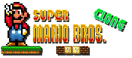

Super Mario Bros. Clone
==========

A clone of Super Mario Bros. 16-bit version game.

### About
This game is based of the Super Mario Bros. 16-bit version featured on Super Mario All-Starts for the SNES. The game is written in Java an using the [LibGdx](http://libgdx.badlogicgames.com/) engine.

### Goal
The ultimate goal is to create a our own Super Mario Bros. like game. The main target platform will eventually be Android.

### Join the project
I started this project to learn about building a game. I have no commercial intentions with this game. Feel free to E-mail me if you want to be a part of this project. Experience is not required! Being interested is enough ;)
